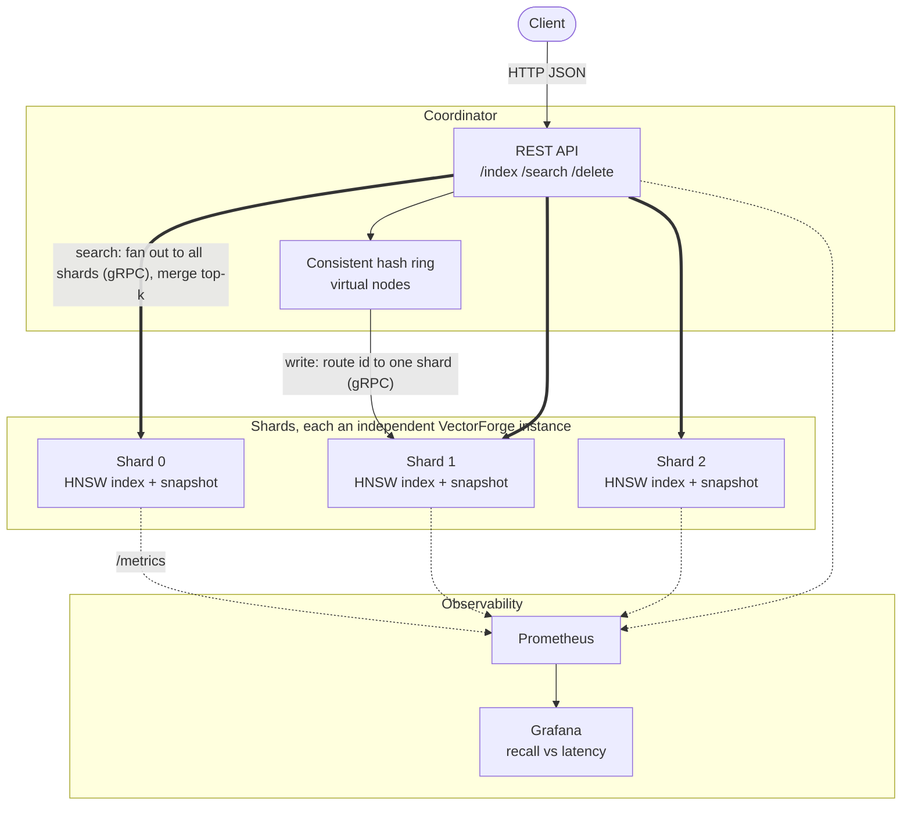

# VectorForge

VectorForge is a vector search engine I built from scratch to understand what
actually happens inside tools like Pinecone or FAISS. Instead of wiring up an
existing library, I wrote the HNSW index, the on-disk format, and the query
layer by hand, so I can explain every part of how it works rather than just
saying I used it.

The short version: you give it high-dimensional vectors, and it finds the
nearest ones to a query fast, without scanning all of them. It does that with
a Hierarchical Navigable Small World graph, and there is a brute-force index
sitting next to it so I can measure exactly how much recall the approximate
search trades away for speed.

**Status:** Phases 1 through 5 are done. The engine runs single-node or as a
sharded cluster, with a REST and gRPC surface, Prometheus metrics, and Grafana
dashboards. Phase 6 (benchmarks and polish) is in progress; I am still holding
back real benchmark numbers until I can stand behind every one of them.

## What is in here

- **Core HNSW index.** Multi-layer graph following the Malkov and Yashunin
  paper, with insert, approximate search, and delete by tombstoning. Built on
  NumPy, with Numba planned for the distance hot path. A reader-writer lock
  makes concurrent search and insert safe under the server's thread pool.
- **Brute-force baseline.** An exact k-NN index that serves as ground truth for
  every recall number, so the benchmarks are honest.
- **Persistence.** A custom binary format (no pickle) that saves and reloads
  the whole graph, including per-vector metadata. It is versioned, so older
  index files still load.
- **Metadata filtering.** Every vector can carry a dictionary of metadata, and
  search takes a predicate that filters results without wrecking recall. The
  filter runs during graph traversal, so non-matching nodes are still walked
  through for connectivity, they just never come back in the results.
- **REST and gRPC APIs.** A FastAPI service exposing `/index`, `/search`,
  `/vectors/{id}`, and `/health`, plus a gRPC servicer wrapping the same core
  index for the low-latency calls between shards.
- **Distributed layer.** A consistent hash ring (written from scratch, with
  virtual nodes) routes each vector to a shard, and a coordinator fans searches
  out to every shard in parallel and merges the top-k by distance.
- **Observability.** Prometheus metrics for query-latency percentiles, index
  size, and recall, a periodic brute-force benchmark that feeds the recall
  gauge, and two Grafana dashboards including the recall-versus-latency view.

## Architecture

A client talks only to the coordinator. Writes are routed to a single shard by
hashing the vector id; searches have no id to hash, so they fan out to every
shard and the coordinator merges the results. Each shard is an independent
VectorForge instance with its own HNSW index and on-disk snapshot.



## Stack

Python 3.11, NumPy and Numba, FastAPI, gRPC, Kubernetes, Prometheus, Terraform.

## Getting started

```bash
python -m venv .venv && source .venv/bin/activate
pip install -e ".[dev]"
pre-commit install
pytest
```

That runs the full test suite, which covers the core index, persistence,
metadata filtering, and the REST API against a running app.

### Running the REST service

```bash
uvicorn vectorforge.api:app --reload
```

The index geometry is read from environment variables, so you can size it per
deployment:

```bash
VECTORFORGE_DIM=128 VECTORFORGE_M=16 VECTORFORGE_EF_CONSTRUCTION=200 \
  uvicorn vectorforge.api:app
```

Index a vector and search for it:

```bash
curl -X POST localhost:8000/index \
  -H 'content-type: application/json' \
  -d '{"id": "doc-1", "vector": [0.1, 0.2, ...], "metadata": {"lang": "en"}}'

curl -X POST localhost:8000/search \
  -H 'content-type: application/json' \
  -d '{"vector": [0.1, 0.2, ...], "k": 10, "filter": {"lang": "en"}}'
```

### Running in Docker

```bash
docker build -t vectorforge .
docker run -p 8000:8000 -e VECTORFORGE_DIM=128 vectorforge
```

The image is a multi-stage build. The heavy toolchain stays in the builder
stage, and only the finished virtualenv gets copied into a slim runtime, which
keeps the final image well under 500 MB even with NumPy and Numba on board.

### Generating the gRPC stubs

The proto lives in `protos/`, and the generated code is not checked in. Run
this once after installing the dev dependencies:

```bash
python -m grpc_tools.protoc -I protos \
  --python_out=src/vectorforge --grpc_python_out=src/vectorforge \
  protos/vectorforge.proto
```

The grpc plugin emits a top-level `import vectorforge_pb2`, which does not
resolve once the stub sits inside the `vectorforge` package. Rewrite it to be
package-relative (portable across sed versions):

```bash
python - <<'PY'
import pathlib
p = pathlib.Path("src/vectorforge/vectorforge_pb2_grpc.py")
p.write_text(p.read_text().replace(
    "\nimport vectorforge_pb2 as", "\nfrom vectorforge import vectorforge_pb2 as"))
PY
```

The gRPC tests skip themselves until these stubs exist, so `pytest` stays green
on a fresh checkout.

## Roadmap

- [x] Phase 1: Core index and brute-force baseline
- [x] Phase 2: Multi-layer HNSW, persistence, delete, metadata filtering
- [x] Phase 3: FastAPI and gRPC API layer
- [x] Phase 4: Kubernetes and observability
- [x] Phase 5: Distributed sharding with a consistent-hash coordinator
- [ ] Phase 6: Benchmarks, polish, launch (in progress)

The recall-versus-latency chart and a benchmark results table go here once the
Phase 6 runs are done. I am not putting numbers on this page until I can back
every one of them.
